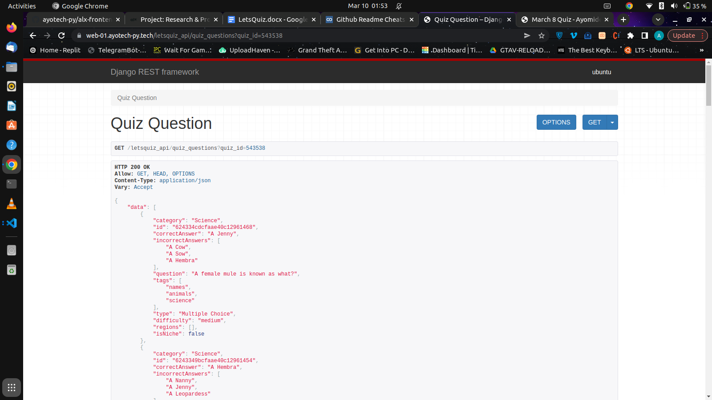
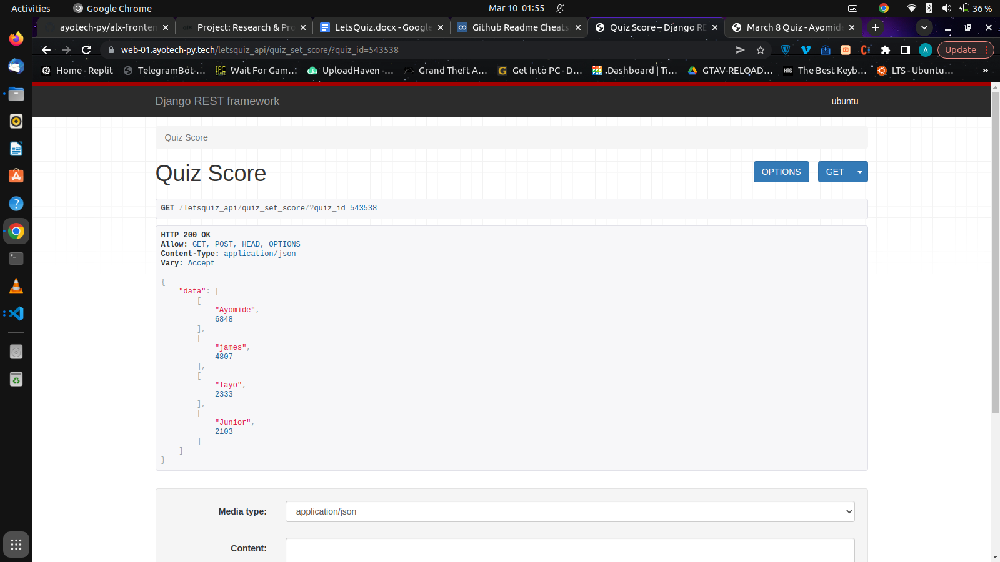

# LetsQuiz

LetsQuiz is a virtual classroom for taking quiz on different subjects

## The Project

We'll know in schools, quizzes are mostly taken physically in the classroom but what if the same quiz can also be organized virtually whereby students can participate from their respective houses.
 
LetsQuiz is a platform whereby a teacher can create a virtual classroom to organize a Quiz for her students. The Teacher/Organizer only needs to sign up and then create a classroom, each classroom will have a unique ID of 6 digits which will be generated automatically, the ID is used by the students to join the classroom.
 
The platform will consist of quizzes on various subjects. The teacher can choose a subject where he/she wants the quiz questions to come from.
 
Here are few screenshots of the webapp API built with Django Restframework

 
Here is the link to view the Webapp live - https://quiz.ayotech-py.tech

## The Context

This project is my Portfolio Project, concluding my Foundations Year at ALX SE Training. I was able to choose what we wanted to work on, as long as I presented a working program at the end of the three weeks of development.

## The Team

I happen the be the only one who would work on this project. I'm Ajao Malik by name, I'm a software engineer, a graphics designer and a tutor.
 
I will be handling the fullstack role in this project.

## Technologies

These are the technologies I'll be using to build my portfolio project

**Frontend**
- HTML
- CSS and
- Javascript
 

**Backend**
- Django (Python)
- Django Restframework
- MySql (database service)
 

**Platforms**
- GeeksforGeeks
- StackOverflow
- Google
 
If I'm to tradeoff Django Web Framework, it would be Flask, but still prefer using Django over flask because Django makes production faster and easier, very efficient, it security it top notch.
 
MySql can also be a tradeoff with prosgresql, but I much more prefer MySql, I've fallen in love with MySql.

## Challenge

As I said earlier in the first paragraph of the Project phase, LetsQuiz will solve the problem of having physical classes for a Quiz, transitioning the physical meetings to Virtual meetings. Quizzes can now be held at your comfort zones
LetsQuiz won't solve the problem of examination Malpractice but will surely minimize it as there is a count down to each question.
 
LetsQuiz will be of much greater help to Teachers and her students. Everyone will be at their respective comfort zone taking/Organizing a Quiz
This project is not locale specific, it can be accessed from anywhere
Risk
 
The risk here is just Examination Malpractice by some of the students, since there might be no one around them to make sure they don't cheat while taking the quiz. The safety measures put in place is that there would be a livestream section for the organizer/Teacher end and also a countdown for each question so rate of cheating will be minimized

## Infrastructure

There would be only one github repo where the codes will be pushed to which will be my github repo (ayotech-py). Since the Project will be done by me only. I'll have a branch for each milestone, after the milestone has passed the testing stage, I can then merge it with the master branch. I'll be testing with Postman, I'll be making use of APIs for fetching quiz questions. I'll also be populating a database for testing from FILmLDB.
Existing Solutions

- Kahoot(https://kahoot.it) - Kahoot! is a free game-based learning platform that makes it fun to learn – any subject, in any language, on any device.
- WebTest(https://www.webtest.ng) - Computer Base Training Examination. We conduct CBT exams for Universities, Polytechnics and Corporate Organisations
 
The improvement I'll be making is that there will be a livestream section for the organizer/Teacher end, which will help in curbing malpractice since the students will be monitored. Any student caught in the act of Malpractice can be flagged by the teacher/Organizer
